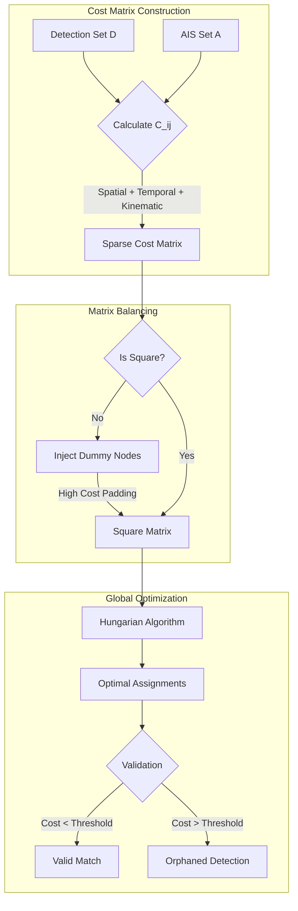
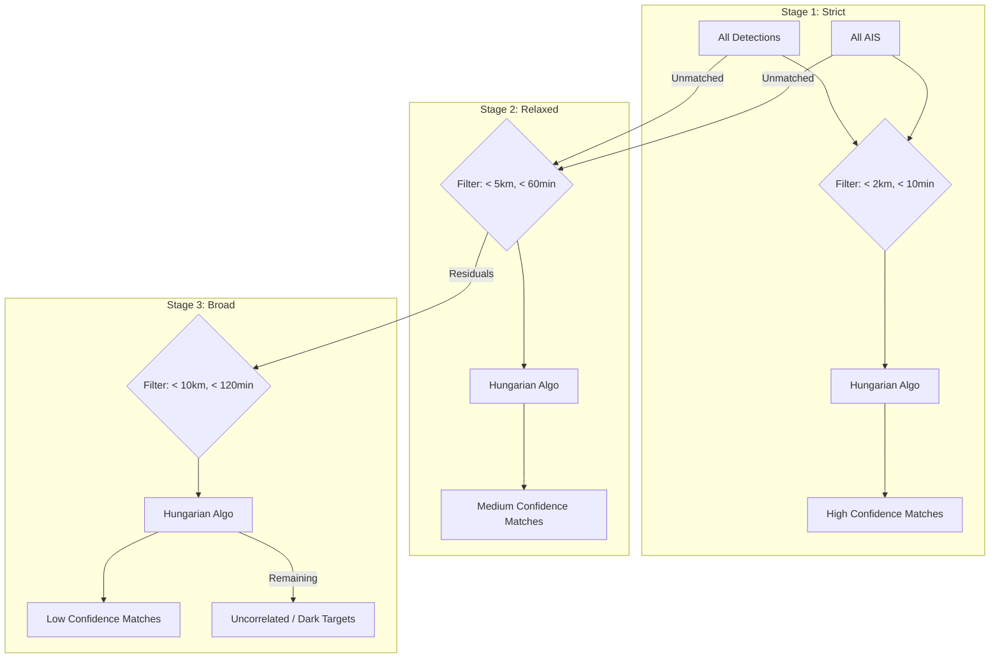

<LLMOnly
  data={`
type: deep-dive
difficulty: advanced
keyTakeaways:
  - Implement weighted bipartite matching for vessel-AIS correlation
  - Use Hungarian algorithm for optimal assignment problems
  - Apply cascaded matching strategy for confidence-based association
  - Understand kinematic coherence and temporal displacement in matching
prerequisites: Graph theory, linear algebra, maritime AIS fundamentals, optimization algorithms
targetAudience: Data scientists working on sensor fusion and tracking systems, maritime intelligence analysts
`}
/>

In the previous section, we explored how OS² detects vessels in satellite imagery. However, detection alone provides incomplete information. A detection tells us "something is here" but does not identify which vessel it is.

The Correlation Engine solves this problem by linking satellite detections to vessel identities from the Automatic Identification System (AIS). This document explains how OS² matches anonymous detections with AIS broadcast data.

## The Problem of Disparate Data Sources

Satellite detections and AIS broadcasts occur at different times and locations. Consider a practical example: a satellite detects a vessel at 14:02:15 UTC at coordinates $(\phi , \lambda)$. The same vessel's AIS transponder last broadcast its position at 14:00:30 UTC.

This creates several problems:

1. **Spatial Disconnect:** The vessel has moved in the 105 seconds between measurements.
2. **Temporal Disconnect:** The datasets are on different timelines.
3. **Data Quality:** Satellite detection is based on physical observation, while AIS is based on self-reported data that may contain errors or be deliberately falsified.

A simple approach of matching each detection to the nearest AIS point would fail in busy shipping lanes. A nearby fishing vessel might be closer geographically than a cargo ship, but the cargo ship moving at 20 knots in that direction would be the correct match based on physics.

OS² solves this as an optimization problem called **weighted bipartite matching**.

## The Cost Function

OS² defines two sets of candidates: detections ($D$) and AIS positions ($A$). The goal is to match them to minimize total cost. The cost of matching detection $i$ with AIS candidate $j$ is calculated as:

$$
C_{ij} = w_s \cdot d_{ij}
+ w_t \cdot f_j(\Delta t)
+ w_l \cdot \Delta L_{ij}
+ w_v \cdot \Delta \beta_{ij}
+ w_h \cdot \Delta h_{ij}
$$

Each component of this equation represents a different physical or temporal factor.

### Spatial Proximity

The Haversine distance is calculated between the detection coordinates and the AIS position at the time of image acquisition. This accounts for Earth's spherical shape and ensures accuracy at different latitudes.

The Haversine formula is:

$$ d = 2R \cdot \arcsin\left(\sqrt{\sin^2\left(\frac{\Delta \phi}{2}\right) + \cos \phi_1 \cos \phi_2 \sin^2\left(\frac{\Delta \lambda}{2}\right)}\right) $$

Where $R$ is Earth's radius, $\phi$ represents latitude, and $\lambda$ represents longitude.

The weight $w_s = 1.0$ treats spatial separation as a linear penalty.

### Temporal Displacement

This term penalizes uncertainty from time gaps. Older AIS data is less reliable because the vessel's actual position may have changed significantly.

OS² uses two methods to estimate where a vessel was at image time:

1. **Interpolation:** When AIS points exist before and after image time, the position is interpolated linearly. This is highly accurate.
2. **Projection:** When only past AIS data exists, the position is projected forward using the vessel's Speed Over Ground (SOG) and Course Over Ground (COG).

Projection is less reliable because vessels can change course. The temporal cost applies a quadratic penalty:

$$
\mathrm{Cost}_{\textit{temporal}}
=
w_t \cdot \left(\frac{\Delta t}{60}\right)^2 \cdot
\begin{cases}
1.0 & \text{if Interpolation} \\
2.0 & \text{if Projection}
\end{cases}
$$

With $w_t = 10.0$, recent AIS pings receive significantly lower costs than older data.

### Morphological Consistency

Vessel length provides additional matching information. Rather than requiring exact length matches, OS² applies a ratio-based penalty that tolerates small differences but penalizes large divergences. This allows for sensor measurement uncertainty while still using length as a discriminator in crowded traffic.

### Kinematic Coherence

A vessel moves in a direction. If AIS reports the vessel moving North ($0 \degree$) but the satellite detection is directly East ($90 \degree$) of the AIS position, the match violates physics.

OS² calculates the required bearing from the AIS position to the detection point and compares it to the vessel's reported Course Over Ground (COG):

$$
\Delta \beta = \mathrm{min\_angular\_diff}\left(\mathrm{Bearing}_{AIS\to Det},\, \mathrm{COG}_{AIS}\right)
$$

The weight $w_v = 20.0$ is high because kinematic violations are strong indicators of false matches.

### Directional Consistency

When AIS includes True Heading (the direction the vessel's bow points), OS² compares it against COG:

$$\Delta h = \mathrm{min\_angular\_diff}\left(\mathrm{Heading}_{AIS},\, \mathrm{COG}_{AIS}\right)$$

The weight $w_h = 15.0$ reflects the importance of this constraint. Critically, if heading data is missing, this term contributes zero cost rather than penalizing incomplete data.

## The Hungarian Algorithm

After calculating costs for all possible detection-to-AIS pairs, a cost matrix is created. The goal is to find the assignment that minimizes total system cost.

A greedy approach fails because selecting the lowest-cost match first can prevent other vessels from matching. The Hungarian Algorithm (Kuhn-Munkres algorithm) solves the assignment problem in polynomial time, $\mathcal{O}(n^3)$, by finding optimal independent matches.

### Handling Non-Square Matrices

Real-world data rarely produces square matrices. There might be 50 detections and 200 AIS candidates, or vice versa. The Hungarian Algorithm requires square matrices, so OS² solves this through dummy nodes:

- **Dummy rows** represent unidentified objects or false alarms.
- **Dummy columns** represent missed detections.

Dummy connections are assigned a high cost threshold ($10^8$). This ensures detections only match to dummy nodes if no real AIS candidate provides a cost below the threshold.

## Cascaded Matching Strategy

Matching all detections simultaneously is risky because uncertain matches can interfere with obvious ones. OS² uses a multi-stage cascaded approach that processes matches in order of confidence.

### Stage One: High Confidence

**Constraints:** Spatial radius less than 2 kilometers, time gap less than 10 minutes.

**Process:** The Hungarian Algorithm runs on this restricted subset. Successful matches are locked as "High Confidence."

**Result:** Matched detections and AIS candidates are removed from the pool.

### Stage Two: Medium Confidence

**Constraints:** Spatial radius less than 5 kilometers, time gap less than 1 hour.

**Process:** The remaining unmatched detections and AIS candidates are matched. This captures vessels with higher AIS latency or small position errors.

### Stage Three: Low Confidence

**Constraints:** Spatial radius less than 10 kilometers, time gap less than 2 hours.

**Process:** A final matching sweep for difficult cases. Matches are flagged for analyst review.

This cascaded approach prioritizes clear evidence while handling ambiguous cases with appropriate caution.

## Confidence Scoring

The confidence scores assigned to matches are heuristic-based, derived from which matching stage they came from. They do not represent statistical probabilities. A "High Confidence" match reflects strong spatiotemporal and kinematic consistency under strict constraints. This approach preserves clarity for analysts and avoids overstating mathematical certainty in inherently uncertain sensor data.

## Conclusion

The Correlation Engine transforms scattered satellite detections into organized intelligence. After processing completes, each detection is either matched to a known vessel or identified as a "dark vessel"—an unmatched target requiring operational attention.

By matching detections with AIS data, OS² distinguishes between known traffic and unknown targets. The unmatched detections represent anomalies and potential security concerns.

However, AIS data contains gaps and periods of silence. To make correlation robust across these gaps, the system must reconstruct vessel positions during periods without broadcasts. The next stage handles this through physics-based trajectory reconstruction.
