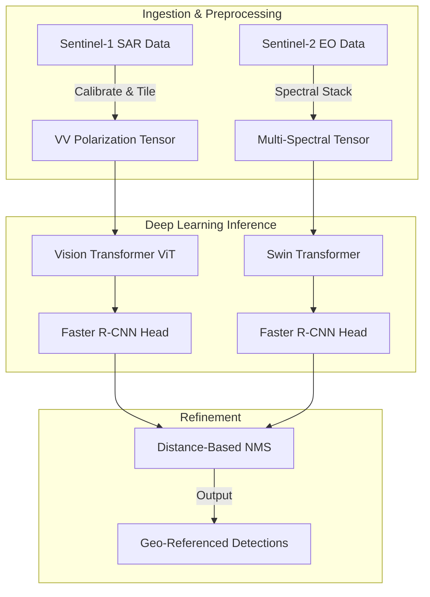
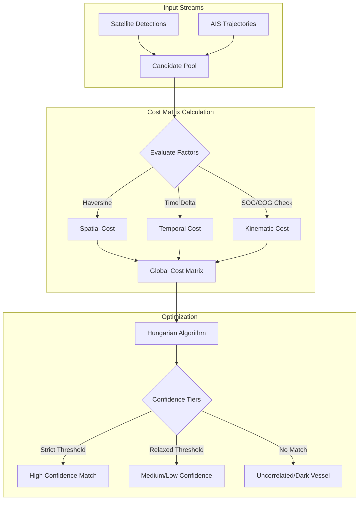
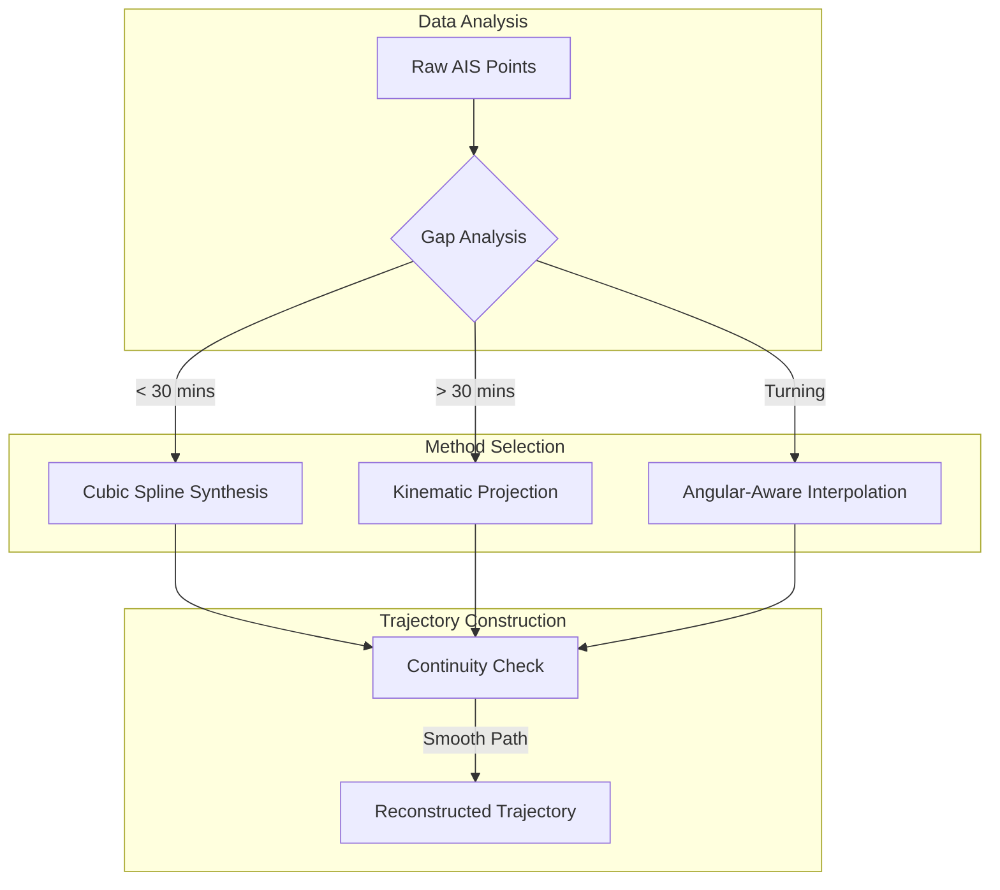

<LLMOnly
  data={`
type: deep-dive
difficulty: intermediate
keyTakeaways:
  - Understand the three-component architecture of OS² maritime monitoring system
  - Learn how satellite imagery and AIS data are integrated for vessel tracking
  - Recognize the operational limitations and decision-support role of the system
  - Appreciate the shift from reactive to proactive maritime monitoring
prerequisites: Basic understanding of satellite imagery, maritime systems, and data integration concepts
targetAudience: Maritime security professionals, systems engineers, and technical analysts working on domain awareness systems
`}
/>

Maritime Domain Awareness (MDA) is the ability to monitor and understand activity on the ocean. Currently, the maritime domain lacks comprehensive coverage. Traditional monitoring relies on manual observation, periodic satellite images, and the Automatic Identification System (AIS)—a voluntary broadcast system that vessels can disable.

AstraQ Cyber Defence has developed OS², a system that integrates three technical components to provide continuous maritime monitoring. This document explains the system architecture, methodology, and operational limitations.

## Current Monitoring Challenges

Maritime monitoring faces a fundamental constraint: the ocean covers seventy percent of Earth's surface, but observation resources are limited. Existing systems create coverage gaps where illegal activities, unauthorized vessel movements, and environmental violations occur without detection.

Current limitations include:

- Manual observation has physical and time constraints
- Satellite images capture only single moments in time
- AIS broadcasts can be disabled by vessels
- Data from different sources remains disconnected

These gaps represent a significant operational challenge for maritime security and environmental protection.

## System Architecture

OS² consists of three integrated components that work together to detect vessels, link detections to vessel identities, and reconstruct complete vessel paths.

### Vessel Detection

The first step is detecting vessels in satellite imagery. This requires distinguishing actual vessels from noise, waves, and atmospheric interference.

OS² uses two satellite data sources:

**Synthetic Aperture Radar (SAR):** Sentinel-One SAR imagery operates in all weather conditions and darkness. The system processes the vertical-vertical (VV) polarization band to identify the distinctive radar signature of metal vessels against the ocean surface.

**Electro-Optical (EO):** Sentinel-Two multispectral imagery provides high-resolution data when weather permits. This data allows the system to estimate vessel dimensions and heading.

The processing workflow functions as follows:

1. Raw satellite data is received and calibrated
2. Data is divided into manageable tiles
3. Deep learning models process each tile
4. Overlapping detections are merged
5. Detections are assigned precise geographic coordinates

The system uses Vision Transformer (ViT) and Swin Transformer neural networks rather than standard convolutional networks. This design choice allows the model to analyze spatial relationships across entire image regions, improving the ability to distinguish vessels from similar-looking ocean features.

### Detection Correlation

A vessel detection provides only a location. To track individual vessels, detections must be linked to AIS broadcasts. This process is called correlation.

The correlation process addresses timing and location uncertainty. A satellite detection occurs at a specific moment, while the corresponding AIS broadcast may have been sent minutes earlier or later. Additionally, both data sources contain measurement error.

OS² solves this as an optimization problem using these factors:

**Spatial Distance:** The system calculates the distance between a detection and AIS position using the Haversine formula, which accounts for Earth's curvature.

**Time Gap:** The system penalizes matches with large time differences, since position becomes less reliable over time.

**Movement Consistency:** The system checks whether a match is physically plausible. A vessel's known direction and speed should be consistent with the detection location.

The system uses the Hungarian Algorithm to find the optimal assignment of detections to AIS positions. This ensures all detections receive consistent identity assignments.

Matches receive confidence scores in three tiers:

- High Confidence: Strong match across all factors
- Medium/Low Confidence: Marginal match with higher uncertainty
- No Match: Detection does not correspond to any AIS broadcast (a "dark vessel")

### Trajectory Reconstruction

AIS broadcasts are intermittent. A vessel might transmit every few seconds or go silent for extended periods. OS² reconstructs vessel paths during these transmission gaps.

The system treats vessels as physical objects with mass, inertia, and turning constraints. Simple straight-line interpolation ignores these physical properties.

OS² employs cubic spline interpolation, which creates curved paths that minimize sharp bends. This approach produces trajectories consistent with actual vessel movement.

The interpolation method varies based on gap duration:

- **Gaps Under Thirty Minutes:** Cubic spline synthesis produces a smooth, continuous path.
- **Gaps Over Thirty Minutes:** Kinematic projection uses known velocity and direction to estimate position.
- **Turning Movements:** Angular-aware interpolation accounts for course changes.

All reconstructed paths maintain continuity in position, velocity, and acceleration to ensure physically realistic trajectories.

## Data Sources and Independence

OS² uses only publicly available data:

- Sentinel-One SAR imagery (free access)
- Sentinel-Two multispectral imagery (free access)
- Standard AIS protocol broadcasts

The system requires no proprietary commercial data or foreign intelligence sources. This design ensures that nations using OS² maintain independent maritime monitoring capability without external dependencies.

## System Limitations

OS² is a decision-support tool with defined limitations:

- **Pattern Detection Only:** The system identifies vessel behavior patterns (loitering, course changes, AIS disablement) but does not determine intent. A vessel loitering in a protected zone may be engaged in illegal fishing, legitimate research, or experiencing mechanical problems. Human analysts must evaluate context.

- **Data-Dependent Performance:** The system operates with available data. It cannot detect vessels when cloud cover prevents optical imaging, and it cannot overcome deliberately spoofed AIS broadcasts or disabled transponders.

- **Decision Support Role:** OS² provides information to human operators and analysts. It does not execute autonomous enforcement actions. All enforcement decisions require human review and authorization.

- **Confidence Assessment:** Every detection, correlation, and trajectory includes confidence scores and uncertainty estimates. Operators can understand not just conclusions but the supporting evidence, enabling informed decision-making.

## Operational Impact

The integration of these three components creates a continuous maritime monitoring system. Even when individual data sources have gaps—cloud cover blocks optical imagery, a vessel disables AIS, or transmission periods are sparse—the system maintains tracking through multiple pathways.

This represents a shift from reactive response to proactive monitoring. Instead of discovering maritime incidents after they occur, maritime authorities can anticipate vessel behavior and respond earlier.

The system transforms the ocean from an area of limited visibility into a monitored domain with continuous operational awareness. Vessel movements that historically occurred unobserved now become detectable, traceable, and analyzable, changing the operational environment for maritime security and environmental protection.

## Conclusion

Maritime Domain Awareness now operates at a technological level where comprehensive monitoring is feasible. By integrating satellite-based detection, intelligent correlation algorithms, and physics-based trajectory reconstruction, OS² provides the technical foundation for effective maritime security and governance. The system respects operational constraints, maintains human oversight, and enables independent national capabilities for maritime monitoring.
