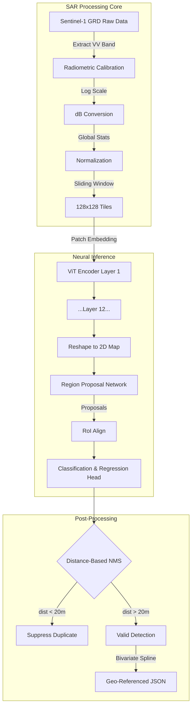
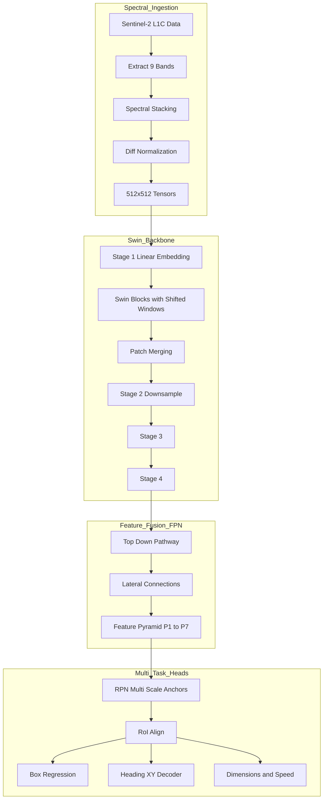

<LLMOnly
  data={`
type: deep-dive
difficulty: advanced
keyTakeaways:
  - Understand SAR and EO sensor physics for maritime vessel detection
  - Learn how Vision Transformers and Swin Transformers process satellite imagery
  - Master the mathematical foundations of patch embedding, attention mechanisms, and feature pyramids
  - Comprehend maritime-specific adaptations like distance-based NMS and cartesian heading decomposition
prerequisites: Deep learning fundamentals, computer vision concepts, understanding of transformer architectures, basic signal processing
targetAudience: Machine learning engineers, computer vision researchers, and technical staff implementing satellite-based detection systems
`}
/>

Vessel detection is the primary function of OS². The goal is to identify ships in satellite imagery and determine their location. This requires distinguishing vessels from ocean features, weather patterns, and sensor noise.

OS² uses two satellite data sources to detect vessels. This document explains how each sensor works, how data is processed, and how deep learning models identify ships.

# Part One: Synthetic Aperture Radar (SAR)

SAR is an active sensor that operates in all weather conditions and darkness. It sends microwave pulses to the ocean and records the returning signal.

## How SAR Works

Optical sensors need sunlight to work. SAR systems send their own signal, so they operate at night and in cloud cover.

The ocean surface reflects radar energy in different ways depending on surface roughness. Smooth water reflects most radar energy away from the sensor, creating dark areas in SAR images. Rough water caused by wind creates a scattered return, which appears as noise in the image.

Vessels are constructed from metal and have angular structures. When radar hits a ship, the signal bounces between the hull, deck, and superstructure multiple times before returning to the sensor. This creates a strong, bright signal that stands out against the darker ocean background.

SAR imagery contains speckle noise—a grainy pattern caused by radar wave interference. Detecting a vessel means finding a structural signal that is distinguishable from this noise pattern.

_Figure: A Sentinel-1 SAR scene illustrating the core challenge of vessel detection._  
SAR imagery is dominated by **speckle noise**—a grainy interference pattern produced by radar wave scattering. A vessel appears as a **bright structural return** caused by multi-bounce reflections from metallic surfaces, and detection means separating this signal from the surrounding ocean texture.

## Processing Sentinel-1 Data

OS² processes Sentinel-1 Ground Range Detected (GRD) products. These are radiometric measurements that must be converted into a format suitable for machine learning.

**Radiometric Calibration** - The system extracts the VV (Vertical-Vertical) polarization band from raw SAR data. VV polarization is more sensitive to ship structures than other polarization modes. Raw amplitude values are converted to the decibel scale using logarithmic compression. This brings extremely bright signals (from vessels) and very faint signals (from ocean) into a manageable numerical range.

**Statistical Normalization** - Neural networks require input data with zero mean and unit variance. SAR data in decibels does not naturally have this property. The system applies global statistical normalization derived from maritime datasets. Extreme values outside the typical range are clipped to remove radar artifacts and land interference.

**Tiling and Georeferencing** - Processing an entire satellite swath in one operation is computationally impractical. The system divides the swath into tiles of 128 by 128 pixels with overlap to ensure vessels are fully captured even when they span tile boundaries.

Each pixel must be mapped back to its precise geographic location. The system uses bivariate spline interpolation with ground control points from satellite metadata to convert pixel coordinates to WGS84 latitude and longitude values.

## Vision Transformer Backbone

OS² uses a Vision Transformer (ViT) for feature extraction instead of a standard convolutional neural network. Convolutional networks process small local regions. Transformers can process entire images, understanding the context of the surrounding ocean surface, which improves the ability to distinguish vessels from wave patterns.

**Patch Embedding** - The input image of 128 by 128 pixels is divided into non-overlapping patches of 4 by 4 pixels, producing 1024 patches total. Each patch is converted to a vector and projected into a higher-dimensional space of 768 dimensions through a learned transformation. Positional embeddings are added to preserve spatial information.

**Patch Embedding Mathematics** - The input image is converted to patches and embedded using the following transformation:

$$z_0 = [x_{patch}^1 E; x_{patch}^2 E; ...; x_{patch}^{1024} E] + E_{pos}$$

Where $E$ is the learned linear transformation and $E_{pos}$ represents positional embeddings.

**Multi-Head Self-Attention** - The core mechanism of the Vision Transformer is self-attention. This computes relationships between every patch and every other patch in the image. The model uses 12 attention heads, allowing it to capture different types of features simultaneously—one head might focus on texture while another focuses on geometric edges.

The attention mechanism is computed as:

$$Attention(Q, K, V) = \text{softmax}\left(\frac{QK^T}{\sqrt{d_k}}\right)V$$

Where $Q$ (Query), $K$ (Key), and $V$ (Value) are matrices derived from input embeddings, and $\sqrt{d_k}$ is a scaling factor to prevent vanishing gradients in the softmax function.

The output passes through a feed-forward network with nonlinear activation functions. After 12 layers of processing, the feature sequence is reshaped back into a 2D feature map of 32 by 32 resolution with 768 channels.

**Detection Head: Faster R-CNN** - A Faster R-CNN detection head is attached to the ViT backbone. This two-stage detector identifies objects and produces bounding boxes around them.

The Region Proposal Network (RPN) slides over the feature map and evaluates anchor boxes of different aspect ratios. For each anchor, it outputs two values: an objectness score (probability of containing a vessel) and coordinate adjustments needed to fit the anchor to the actual vessel location.

**RPN Loss Function** - The loss function for the Region Proposal Network combines classification and regression:

$$\mathcal{L}^{RPN} = \mathcal{L}_{cls} + \lambda \mathcal{L}_{reg} $$

The regression loss uses Smooth L1 Loss, which is robust to outliers—important when dealing with noisy SAR data.

**Distance-Based Non-Maximum Suppression** - Standard non-maximum suppression (NMS) uses intersection-over-union (IoU) to eliminate duplicate detections. This works poorly for vessels because ships are long and thin. A diagonal-oriented ship in a standard bounding box may have low IoU with another box that describes the same vessel.

OS² implements distance-based NMS instead. It calculates the Euclidean distance between the centers of bounding boxes:

$$d_{ij} = \sqrt{(x_i - x_j)^2 + (y_i - y_j)^2}$$

If $d_{ij} < t_{dist}$ (set to 20 meters for Sentinel-1), the lower-confidence box is suppressed. This reflects physical reality—two separate vessels cannot occupy the same 20-meter radius.

## Part Two: Electro-Optical (EO) Detection

Sentinel-2 optical imagery provides visual confirmation and spectral information. Where SAR answers "is there something here", EO answers "what is this object made of and what are its characteristics".

### Multispectral Imaging

Sentinel-2 captures light across 13 spectral bands. OS² uses nine bands selected for maritime applications:

- **Visible bands (RGB):** Standard visual features and hull color.
- **Red-edge bands:** Sensitive to vegetation and material differences.
- **Near-infrared:** Water absorbs near-infrared light while metal objects reflect it, creating strong contrast.
- **Shortwave infrared:** Penetrates atmospheric haze better than visible light and detects moisture, helping distinguish metal from water.

The system applies differential normalization. RGB bands use one set of normalization constants while other bands use different scaling factors. This preserves the relative differences between spectral bands that the model uses for classification.

### Swin Transformer Architecture

EO detection must handle vessels of varying sizes. A small fishing boat might be one pixel while a large container ship might be 30 pixels. The Swin Transformer is a hierarchical architecture designed to process images at multiple scales.

**Shifted Window Attention** - The Swin Transformer computes self-attention only within local windows rather than globally across the entire image. This reduces computational cost while still allowing information to flow between windows through a shifting mechanism. In alternating layers, the window position shifts by half a window width, allowing the model to build global understanding step-by-step.

**Hierarchical Processing** -The Swin Transformer processes images in stages. After each stage, neighboring pixels are merged together and features are compressed. This creates a hierarchy of feature maps:

1. Stage one at 128 by 128 resolution captures fine details.
2. Stage two at 64 by 64 resolution.
3. Stage three at 32 by 32 resolution.
4. Stage four at 16 by 16 resolution captures semantic context.

### Feature Pyramid Network

A Feature Pyramid Network (FPN) fuses features from different scales. High-level semantic features are upsampled and combined with low-level detailed features. This is computed as:

$$P_3 = Conv_{1 \times 1}(C_3) + Upsample(P_5)$$

This creates a pyramid where every level contains both semantic meaning and spatial detail.

A separate Faster R-CNN detection head is attached to each pyramid level with anchor sizes matched to that level:

- High-resolution levels use small anchors for small boats.
- Low-resolution levels use large anchors for large ships.

This scale-adaptive approach ensures that detection performance is consistent across vessel sizes.

### Attribute Extraction

Beyond identifying vessel locations, the system extracts vessel attributes from optical data. When a vessel is detected, the surrounding feature map is processed by multiple decoder heads:

1. **Length and width:** Predicted using regression with smooth L1 loss.
2. **Speed (SOG):** Inferred from wake patterns visible in the image.
3. **Heading:** Ship direction is a circular variable where 359 degrees and 1 degree are nearly identical. The system decomposes heading into cartesian coordinates so the network can learn orientation without discontinuity:

$$x = \cos(\theta_{ENU} \cdot \frac{\pi}{180})$$

$$y = \sin(\theta_{ENU} \cdot \frac{\pi}{180})$$

This cartesian decomposition allows the network to learn heading as a continuous function without the wraparound problem at 360 degrees.

## Conclusion

OS² uses two complementary sensors to detect vessels. SAR operates in all weather and darkness, providing reliable detection when optical sensors cannot function. EO imagery provides detailed information about vessel characteristics and attributes.

Vision Transformers process SAR data by understanding the global context of ocean texture. Swin Transformers process EO data at multiple scales to handle vessels of different sizes. These architectures, combined with maritime-specific design choices like distance-based NMS and cartesian heading decomposition, provide robust vessel detection across diverse maritime conditions.

Detection identifies vessel locations. The next step is correlating these detections with vessel identities from AIS broadcasts. This process is covered in the subsequent technical documentation.
